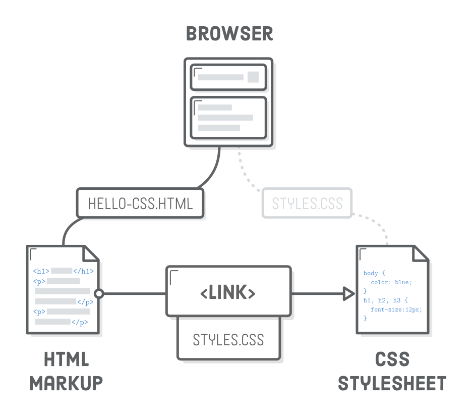

<!--
_paginate: false
-->
# ***Internting is hard in 20201***

_Fortunat Mutunda_


***_[Interneting is hard &copy;2021](https://www.internetingishard.com/)_***

---
<!--
_paginate: false
-->
### ***CHAPTER 4***
##### _Hello, CSS_

---
# ***Introduction***
CSS (Cascading StyleSheet) is like natural beauty without makeup.
- HTML bones
- CSS muscles and skin
___
# ***Syntax***
```css
body {
  color: #414141;    /* Dark gray */
}
```

___
# ***Linking a css stylesheet***
```html
<head>
  <meta charset='UTF-8'/>
  <title>Hello, CSS</title>
  <link rel='stylesheet' href='styles.css'/>
</head>
```
_Note: Don't forget to add `rel='stylesheet'`_

___


___
# ***CSS comments***
```css
body {
  color: #414141;    /* Dark gray */
}
```
_Note the `/* */` and the text in between_

___
# ***Setting multiple properties***
```css
body {
  color: #414141;               /* Dark gray */
  background-color: #EEEEEE;    /* Light gray */
}
```

___
# ***Selecting different elements***
```css
body {
  color: #414141;               /* Dark gray */
  background-color: #EEEEEE;    /* Light gray */
}

h1 {
  font-size: 36px;
}

h2 {
  font-size: 28px;
}
```
___
# ***Units of measurement***
- pixel `px`
- em(pronounced like the letter m) `em`

___
The em unit is very useful for defining sizes relative to some base font. In the above diagram, you can see em units scaling to match a base font size of 12px, 16px, and 20px. For a concrete example, consider the following alternative to the previous code snippet:
___
```css
body {
  color: #414141;               /* Dark gray */
  background-color: #EEEEEE;    /* Light gray */
  font-size: 18px;
}

h1 {
  font-size: 2em;
}

h2 {
  font-size: 1.6em;
}
```
___
This sets our base font size for the document to 18px, then says that our <h1> elements should be twice that size and our <h2>’s should be 1.6 times bigger. If we (or the user) ever wanted to make the base font bigger or smaller, em units would allow our entire page to scale accordingly.
___
# ***Selecting multiple elements***
```css
h1 {
  font-family: "Helvetica", "Arial", sans-serif;
}
h2 {
  font-family: "Helvetica", "Arial", sans-serif;
}
h3 {
  font-family: "Helvetica", "Arial", sans-serif;
}
```
```css
h1, h2, h3, h4, h5, h6 {
  font-family: "Helvetica", "Arial", sans-serif;
}
```
___
# ***Defining fonts***
`font-family` is another built-in CSS property that defines the typeface for whatever element you selected. It accepts multiple values because not all users will have the same fonts installed.
```css
h1 {
  font-family: "Helvetica", "Arial", sans-serif;
}
```